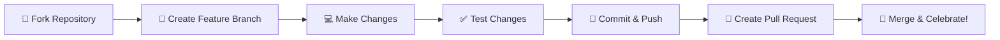

# 💰 Fin. Tracker - Your Personal Finance Guardian

<div align="center">

**Take complete control of your financial future with our secure, offline-first finance manager**

[](https://flutter.dev/)
[](https://flutter.dev/)
[](https://pub.dev/packages/sqflite)
[](https://opensource.org/licenses/MIT)

[](https://github.com/abhishek0112cs221008/project_track_your_finance)
[](https://www.indusappstore.com/apps/finance/finance-tracker/com.example.project_track_your_finance/)


</div>

---

## 🌟 Why Choose Fin. Tracker?

> **"Your money, your data, your device - complete financial privacy guaranteed!"**

In an era where financial apps collect and sell your data, **Fin. Tracker** stands apart as your completely private financial companion. Built with privacy-first architecture, every transaction stays on your device, giving you complete control over your financial information.

### 🎯 Perfect For:
- 👨‍💼 **Professionals** tracking business expenses
- 👩‍🎓 **Students** managing tight budgets
- 👨‍👩‍👧‍👦 **Families** planning household finances
- 🏠 **Anyone** wanting simple, secure expense tracking

---

## ✨ Powerful Features That Set Us Apart

<table>
<tr>
<td width="50%">

### 🚀 Core Features
- **📊 Smart Transaction Logging** - Lightning-fast expense & income entry
- **📈 Beautiful Visual Analytics** - Interactive charts and insights
- **🔐 Military-Grade Security** - PIN protection with encryption
- **📴 100% Offline Operation** - No internet? No problem!
- **🔍 Advanced Search Engine** - Find any transaction instantly
- **🎨 Intuitive Design** - Clean, modern interface

</td>
<td width="50%">

### 💡 Smart Insights
- **📊 Spending Pattern Analysis** - Understand where your money goes
- **📅 Monthly/Yearly Reports** - Track financial progress over time
- **🏷️ Category Management** - Organize expenses your way
- **💹 Balance Tracking** - Real-time financial overview
- **📱 Cross-Device Sync** - Backup and restore functionality
- **🌙 Dark/Light Themes** - Comfortable viewing anytime

</td>
</tr>
</table>

---

## 📱 App Gallery

<div align="center">

### 🏠 Dashboard Overview


*Get a complete financial overview at a glance*

---

### 📋 Transaction Management


*View and manage all your financial activities*

---

### ➕ Quick Add Feature


*Add transactions in seconds with smart categorization*

</div>

---

## 🛠️ Built With Cutting-Edge Technology

<div align="center">

| Technology | Purpose | Why We Chose It |
|------------|---------|-----------------|
| 🦋 **Flutter** | Cross-platform framework | Beautiful native performance |
| 🎯 **Dart** | Programming language | Fast, modern, and efficient |
| 🗄️ **SQLite** | Primary database | Reliable offline storage |
| 📦 **Hive** | Key-value storage | Lightning-fast data access |
| 🔄 **Provider** | State management | Clean, scalable architecture |

</div>

---

## 📚 Complete Documentation

<div align="center">

📖 **[Detailed Project Report](https://github.com/user-attachments/files/20541147/project.report.docx)** | 🎯 **[Presentation Slides](https://github.com/user-attachments/files/20541145/Finance_Tracker_APP_6Sem_.ppt.pptx)**

*Dive deep into our development process, architecture decisions, and implementation details*

</div>

---

## 🚀 Quick Start Guide

### 📋 Prerequisites
```bash
✅ Flutter SDK 3.0+ installed
✅ Android Studio or VS Code
✅ Git for version control
```

### ⚡ Installation Steps

```bash
# 1️⃣ Clone the repository
git clone https://github.com/abhishek0112cs221008/project_track_your_finance.git

# 2️⃣ Navigate to project directory
cd project_track_your_finance

# 3️⃣ Install dependencies
flutter pub get

# 4️⃣ Run the application
flutter run
```

### 🎉 That's it! Your finance tracker is ready to use!

---

## 📲 Get The App Now!

<div align="center">

### 🏪 Download from Indus Appstore

<a href="https://www.indusappstore.com/apps/finance/finance-tracker/com.example.project_track_your_finance/?page=details&id=com.example.project_track_your_finance">
  
</a>

*Join thousands of users who've taken control of their finances!*

</div>

---

## 🤝 Join Our Community

We believe in the power of open source! Your contributions help make Fin. Tracker better for everyone.

### 🌟 How to Contribute

<div align="center">



</div>

#### Step-by-Step:
1. **🍴 Fork** the repository
2. **🌿 Create** your feature branch: `git checkout -b feature/AmazingFeature`
3. **💻 Commit** your changes: `git commit -m 'Add some AmazingFeature'`
4. **📤 Push** to the branch: `git push origin feature/AmazingFeature`
5. **🔄 Open** a Pull Request

### 💡 Contribution Ideas
- 🎨 UI/UX improvements
- 🔧 New features and enhancements
- 🐛 Bug fixes and optimizations
- 📖 Documentation improvements
- 🌍 Localization and translations

---

## 📈 Project Stats

<div align="center">


</div>

---

## 📄 License & Legal

This project is licensed under the **MIT License** - see the [LICENSE](LICENSE) file for complete details.

```
MIT License - Free to use, modify, and distribute
```

---

## 👨‍💻 Meet The Developer

Contributors
<div align="center"><table> <tr> <td width="20%" align="center" valign="top"> <!-- Side Logo --> </td> <td width="80%" valign="top"> <!-- Names List --> <ul> <li><strong>Abhishek Patel (06)</strong></li> <li><strong>Kunjdev Patel (73)</strong></li> <li><strong>Abhishek Patel (08)</strong></li> </ul> </td> </tr> </table> </div>

---

## 🙏 Support & Feedback

<div align="center">

**Love Fin. Tracker?** 

⭐ **Star this repository** to show your support!

🐛 **Found a bug?** Open an issue and we'll fix it ASAP!

💡 **Have an idea?** We'd love to hear your suggestions!

---

**Made with ❤️ in India for financial freedom worldwide**

</div>

---

<div align="center">

### 📊 Repository Insights


**Thank you for being part of our financial freedom mission! 🚀**

</div>
